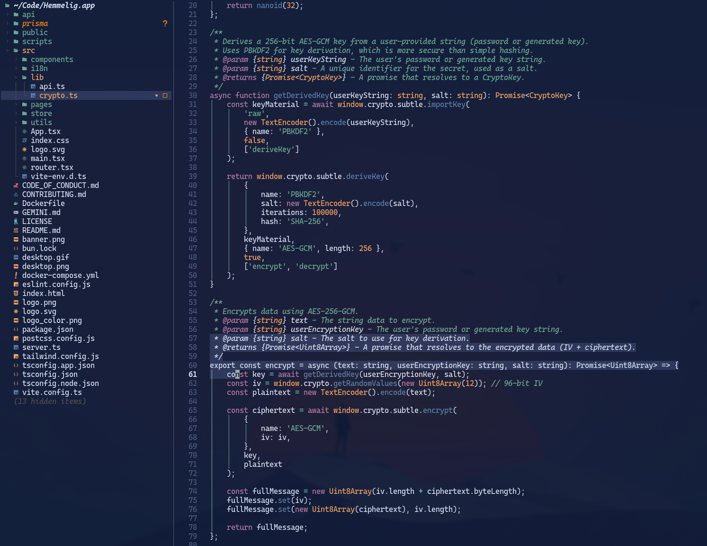

# Reverie

Reverie is a simple, elegant, and dark theme for Neovim. It's designed for those moments of deep focus, when the world fades away and all that's left is you and your code.

<p align="center">
  
</p>

> Where sky and shadow softly meet,  
> the world outside makes its retreat.  
> The mind, in silent reverie,  
> is calmed by light it came to see,  
> and finds itself completely free.  

## Installation

Install with your favorite plugin manager.

### lazy.nvim

Add the following to your `lazy.nvim` configuration:

```lua
{
  "bjarneo/reverie.nvim",
  priority = 1000,
  config = function()
    vim.cmd([[colorscheme reverie]])
  end,
}
```

## Usage

To use the theme, add the following to your `init.lua`:

```lua
vim.cmd.colorscheme "reverie"


## AI 
This entire repo is made by using AI. Meaning the folder structure is not as it should be, and this is to be cleaned up.
```

